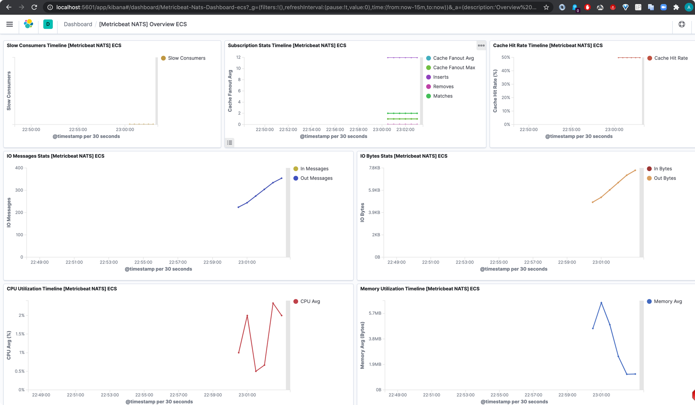

### Objective : 

To get NATS-Streaming Dashboard on Kibana using NATS-Streaming, Elasticsearch, Kibana, Metricbeat (custom image) in docker-compose

#### Dir structure

```bash
local-mac/task-009-natsStreaming-metricbeat-elasticsearch-kibana
├── ReadMe.md
├── docker
│   └── metricbeat
│       ├── Dockerfile
│       ├── entrypoint.sh
│       └── metricbeat.yml
└── docker-compose.yml
```

- docker-compose.yaml

```yaml
version: '3.7'
services:
  elasticsearch_service:
    image: docker.elastic.co/elasticsearch/elasticsearch:7.8.0
    container_name: es01
    environment:
      node.name: 'es01'
      discovery.type: 'single-node'
      bootstrap.memory_lock: 'true'
      ES_JAVA_OPTS: '-Xms512m -Xmx512m'
    ulimits:
      memlock:
        soft: -1
        hard: -1
#    volumes:
#      - ./.data:/usr/share/elasticsearch/data
    ports:
      - 9200:9200
    networks:
      - host

  kibana:
    image: docker.elastic.co/kibana/kibana:7.8.0
    container_name: kibana-sandbox
    links:
      - elasticsearch_service
    environment:
      SERVER_NAME: elasticsearch_service
      ELASTICSEARCH_HOSTS: http://elasticsearch_service:9200
    ports:
      - 5601:5601
    networks:
      - host

  # Container to monitor services running inside other containers
  metricbeat:
    build: ./docker/metricbeat
    container_name: metricbeat-metricbeat-services
    command: -e
    environment:
      - "WAIT_FOR_HOSTS=elasticsearch_service:9200 kibana:5601"
      - "HOST_ELASTICSEARCH=elasticsearch_service:9200"
      - "HOST_KIBANA=kibana:5601"
    depends_on:
      - elasticsearch_service
    networks:
      - host


  nats-streaming-1:
    restart: always
    command:
      - "--cluster"
      - "nats://0.0.0.0:6222"
      - "--cluster_id"
      - nats-streaming
      - "--clustered"
      - "--cluster_bootstrap"
      - "--cluster_log_path"
      - /data/log
      - "--cluster_node_id"
      - nats-streaming-1
      - "--cluster_raft_logging"
      - "--debug"
      - "--dir"
      - /data/msg
      - "--http_port"
      - "8222"
      - "--port"
      - "4222"
      - "--store"
      - file
      - "--stan_debug"
      - "--hb_interval"
      - 2s
      - "--hb_fail_count"
      - "1"
      - "--hb_timeout"
      - 5s
    image: "nats-streaming:0.18.0"
    networks:
      - host
    ports:
      - "4222:4222"
      - "8222:8222"
#    volumes:
#      - "./nats-streaming-1:/data"


volumes:
  data:
    driver: local

networks:
  host:
```

- metricbeat/Dockerfile

```dockerfile
FROM docker.elastic.co/beats/metricbeat:7.8.1

# The file to monitor the host is different from the file to monitor docker services.ADD
# So we pass the filename at build time to choose the target (host or services) of the image built.
ARG METRICBEAT_FILE=metricbeat.yml
COPY ${METRICBEAT_FILE} /usr/share/metricbeat/metricbeat.yml

USER root

RUN yum -y install nc

RUN mkdir /var/log/metricbeat \
    && chown metricbeat /usr/share/metricbeat/metricbeat.yml \
    && chmod go-w /usr/share/metricbeat/metricbeat.yml \
    && chown metricbeat /var/log/metricbeat

COPY entrypoint.sh /usr/local/bin/custom-entrypoint
RUN chmod +x /usr/local/bin/custom-entrypoint

USER metricbeat

ENTRYPOINT ["/usr/local/bin/custom-entrypoint"]
```

- metricbeat/metricbeat.yml

```yaml
metricbeat.modules:

#------------------------------- NATS Module -------------------------------
- module: nats
  metricsets: ["connections", "routes", "stats", "subscriptions"]
  period: 10s
  hosts: ["nats-streaming-1:8222"]

#------------------------------- MySQL Module -------------------------------
#- module: mysql
#  enabled: true
#  metricsets: ["status"]
#  period: 5s
#  hosts: ["tcp(mysql:3306)/"]
#  username: root
#  password: root

#------------------------------- MongoDB Module -------------------------------

#- module: mongodb
#  enabled: true
#  metricsets: ["status", "dbstats"]
#  period: 5s
#  hosts: ["mongodb:27017"]

#------------------------------- MongoDB Module -------------------------------
#- module: apache
#  enabled: true
#  metricsets: ["status"]
#  period: 5s
#  hosts: ["http://apache"]

#------------------------------- Redis Module -------------------------------
#- module: redis
#  enabled: true
#  metricsets: ["info", "keyspace"]
#  period: 5s
#  hosts: ["redis:6379"]

#------------------------------- Nginx Module -------------------------------
#- module: nginx
#  enabled: true
#  metricsets: ["stubstatus"]
#  period: 5s
#  hosts: ["http://nginx"]
#  server_status_path: "nginx_status"

#-------------------------- Elasticsearch output ------------------------------
output.elasticsearch:
  #password: ""
  hosts: ["${HOST_ELASTICSEARCH}"]

setup.kibana:
  host: "${HOST_KIBANA}"

#============================== Dashboards =====================================
# These settings control loading the sample dashboards to the Kibana index. Loading
# the dashboards is disabled by default and can be enabled either by setting the
# options here, or by using the `-setup` CLI flag.
setup.dashboards.enabled: true

logging.level: warning
logging.to_files: true
logging.to_syslog: false
logging.files:
  path: /var/log/metricbeat
  name: metricbeat.log
  keepfiles: 2
  permissions: 0644
```

- metricbeat/entrypoint.sh

```bash
#!/usr/bin/env bash

wait_single_host() {
  local host=$1
  shift
  local port=$1
  shift

  echo "==> Check host ${host}:${port}"
  while ! nc ${host} ${port} > /dev/null 2>&1 < /dev/null; do echo "   --> Waiting for ${host}:${port}" && sleep 1; done;
}

wait_all_hosts() {
  if [ ! -z "$WAIT_FOR_HOSTS" ]; then
    local separator=':'
    for _HOST in $WAIT_FOR_HOSTS ; do
        IFS="${separator}" read -ra _HOST_PARTS <<< "$_HOST"
        wait_single_host "${_HOST_PARTS[0]}" "${_HOST_PARTS[1]}"
    done
  else
    echo "IMPORTANT : Waiting for nothing because no $WAIT_FOR_HOSTS env var defined !!!"
  fi
}

wait_all_hosts

#while ! curl -s -X GET ${HOST_ELASTICSEARCH}/_cluster/health\?wait_for_status\=yellow\&timeout\=60s | grep -q '"status":"green"'
#do
#    echo "==> Waiting for cluster YELLOW status" && sleep 1
#done
#
#echo ""
#echo "Cluster is YELLOW. Fine ! (But you could maybe try to have it GREEN ;))"
#echo ""

## to wait to http://kibana:5601/api/status to be up
sleep 60

bash -c "/usr/local/bin/docker-entrypoint $*"
```

- Start the docker-compose

```bash
$ doker-compose up
Creating network "task-009-natsstreaming-metricbeat-elasticsearch-kibana_host" with the default driver
Creating volume "task-009-natsstreaming-metricbeat-elasticsearch-kibana_data" with local driver
Building metricbeat
Step 1/10 : FROM docker.elastic.co/beats/metricbeat:7.8.1
.
.
Creating es01                                                                      ... done
Creating task-009-natsstreaming-metricbeat-elasticsearch-kibana_nats-streaming-1_1 ... done
Creating metricbeat-metricbeat-services                                            ... done
Creating kibana-sandbox                                                            ... done
Attaching to es01, task-009-natsstreaming-metricbeat-elasticsearch-kibana_nats-streaming-1_1, metricbeat-metricbeat-services, kibana-sandbox
```

- Dashboard images




